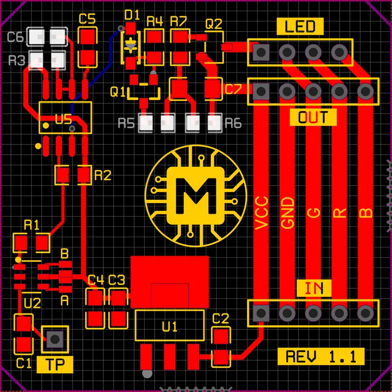

Flexible modular system. The modules are connected to each other to form a single network. Each module works independently of the others.

The entire system consists of a basic control module with **ESP8266** and an endless set of sensor modules.

The number of modules is limited only by the power of the power supply.

On the base module you can set the color and brightness of the diodes.

## Build
The hexagon parts always have the same distance to each other, use spacers to insert. Also use hexagon spacers to tightly fill the perimeter

The hexagons are printed in two colors. The top in Black and the rest in Clear.

## PCB

Solder pin A for a low signal when sensor triggered. **C1** capacitor serves to reduce the sensitivity of the sensor. I didn't solder it.

You can adjust the glow time and smoothness of the diodes.
All this can be configured on the sensor board by replacing elements **C6**, **R3**, **R5**, **R6**.

- **C6**, **R3** are responsible for the glow time of the diodes and is calculated by the formula t=C6xR3x1.1 (in my case ~1s);
- **R5** is responsible for fade-in of the diodes;
- **R6** is responsible for fade-out of the diodes;

## Assembly
For the sensor to work, it is necessary to make a ring of copper wire, I use 2.5 mm2. For even winding, use a round tower. Solder the ring to the **TP** pin with wire. 

Cut 15cm of LED strip (3 sections) and solder the contacts with wire into a ring. Solder wires to these contacts for further connection to the sensor board.

You can connect the LED strip both from the inside and from the outside, make sure that the wires are as far away from the touch ring as possible.

Place everything in its place in the hexagon.

The sensor module is ready.

The modules are connected sequentially one after another into a single network using JST connectors for quick replacement or hard soldered with wires.
